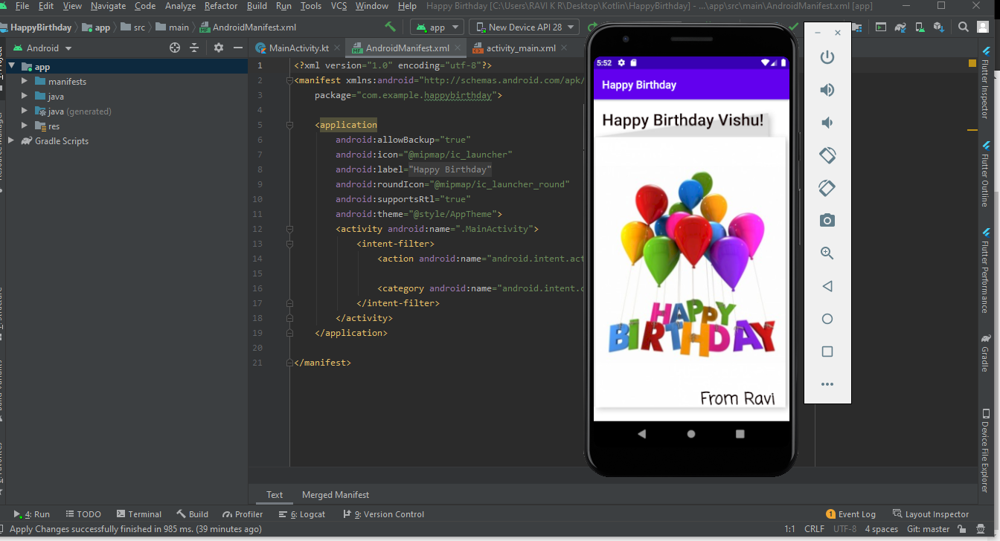
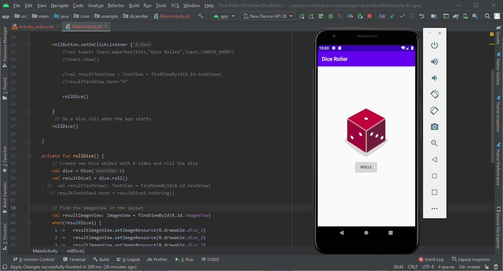
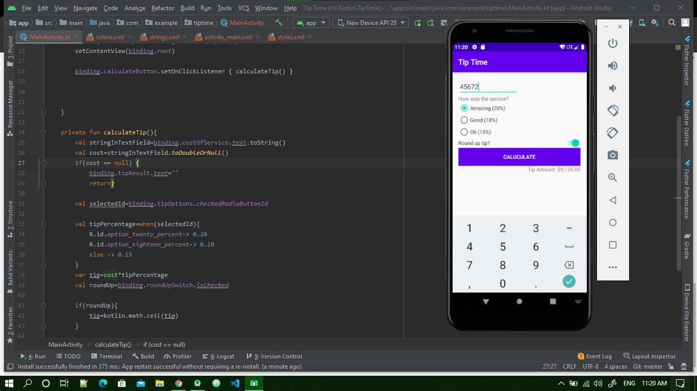

# Kotlin
Google official Documantation-course-and-my Projects 

Developing Android apps with Kotlin.

**1] Birthday Card app**

**2] Dice Roller App**

**3] TipTime App**

**Requirements**
- Android Studio 4.0.0
- JDK 8
- Android SDK 29
- Supports API Level +21
- Material Components 1.3.0-alpha01

**Highlights**
- Use [-] API
- Use Material Design 
- Dark Mode
- Support two language. English 
- Use locale Database

**Demo** application is available in [-]
